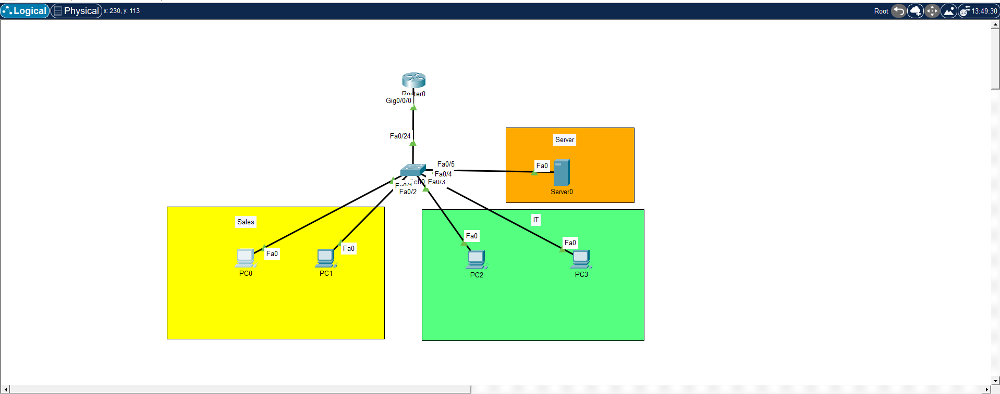
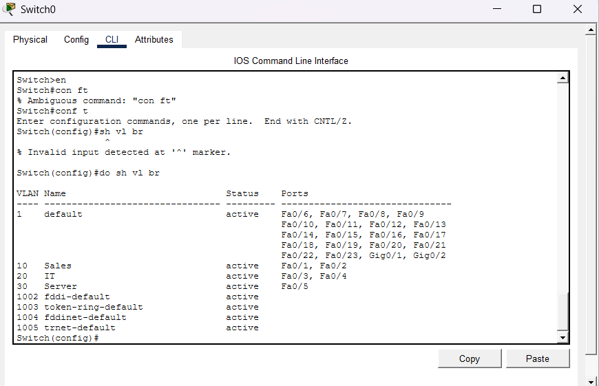
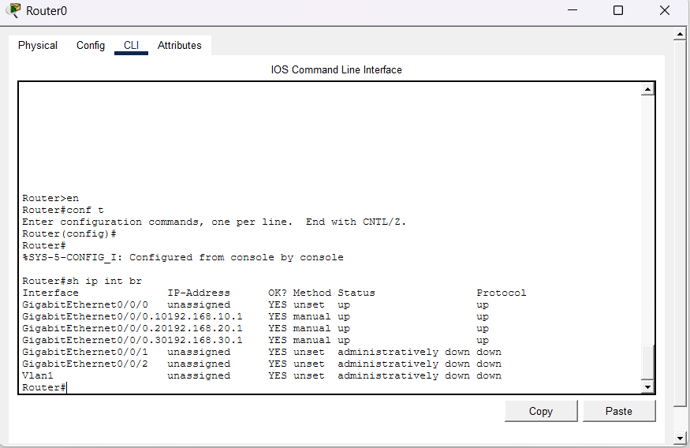

# 🏢 Small Office VLAN Network

A hands-on Cisco Packet Tracer project simulating a small office network with separate **Sales** and **IT** departments. The departments are separated using VLANs but can communicate with each other and access a shared server through **Router-on-a-Stick inter-VLAN routing**.

## 🎯 Objective

The goal of this project was to build a small office network that provides:

* Separate VLANs for Sales and IT
* Communication between Sales and IT
* A separate network for a shared server
* Inter-VLAN routing using Router-on-a-Stick
* Static IPv4 addressing
* Basic network connectivity testing and troubleshooting

## 🖥️ Network Topology



### Devices Used

* 1 × Cisco Router
* 1 × Cisco Switch
* 4 × PCs
* 1 × Server
* Cisco Packet Tracer

## 🔧 Technologies & Concepts

* VLANs
* Access Ports
* 802.1Q Trunking
* Router-on-a-Stick
* Inter-VLAN Routing
* IPv4 Subnetting
* Static IP Addressing
* Ping Connectivity Testing
* Basic Network Troubleshooting

## 🌐 IP Addressing

| Device | Department    | VLAN | IP Address       | Default Gateway |
| ------ | ------------- | ---: | ---------------- | --------------- |
| PC1    | Sales         |   10 | 192.168.10.11/24 | 192.168.10.1    |
| PC2    | Sales         |   10 | 192.168.10.12/24 | 192.168.10.1    |
| PC3    | IT            |   20 | 192.168.20.11/24 | 192.168.20.1    |
| PC4    | IT            |   20 | 192.168.20.12/24 | 192.168.20.1    |
| Server | Shared Server |   30 | 192.168.30.10/24 | 192.168.30.1    |

## 🔀 VLAN Configuration

| VLAN | Name   | Network         | Purpose          |
| ---: | ------ | --------------- | ---------------- |
|   10 | Sales  | 192.168.10.0/24 | Sales Department |
|   20 | IT     | 192.168.20.0/24 | IT Department    |
|   30 | Server | 192.168.30.0/24 | Shared Server    |

### Switch Port Assignment

| Switch Port | Device | Mode   |       VLAN |
| ----------- | ------ | ------ | ---------: |
| Fa0/1       | PC1    | Access |         10 |
| Fa0/2       | PC2    | Access |         10 |
| Fa0/3       | PC3    | Access |         20 |
| Fa0/4       | PC4    | Access |         20 |
| Fa0/5       | Server | Access |         30 |
| Fa0/24      | Router | Trunk  | 10, 20, 30 |

## 🖥️ Switch Verification

The `show vlan brief` command was used to verify VLAN creation and port assignments.



## 🚦 Router-on-a-Stick Configuration

The connection between the switch and router is configured as an **802.1Q trunk**.

Router subinterfaces:

| Subinterface | VLAN | IP Address      |
| ------------ | ---: | --------------- |
| G0/0.10      |   10 | 192.168.10.1/24 |
| G0/0.20      |   20 | 192.168.20.1/24 |
| G0/0.30      |   30 | 192.168.30.1/24 |

The router uses these subinterfaces as the default gateways for the three networks.

## 🖥️ Router Interface Verification

The `show ip interface brief` command was used to verify the router interfaces and subinterfaces.



## 🧪 Connectivity Testing

The following connectivity tests were successfully completed:

* [x] PC1 → PC2
* [x] PC1 → PC3
* [x] PC1 → PC4
* [x] PC1 → Server
* [x] PC1 → Router Gateway
* [x] PC3 → Server

### Example

From PC1:

```text
ping 192.168.20.11
```

This tests communication from the **Sales VLAN (VLAN 10)** to the **IT VLAN (VLAN 20)** through the router.

## 🧠 What I Learned

Through this lab, I practiced:

* Creating and naming VLANs
* Assigning switch ports to VLANs
* Understanding access ports and trunk ports
* Configuring 802.1Q trunking
* Configuring router subinterfaces
* Implementing Router-on-a-Stick
* Understanding inter-VLAN routing
* Configuring static IPv4 addresses
* Configuring default gateways
* Verifying network configuration using Cisco IOS commands
* Testing connectivity using `ping`
* Troubleshooting basic network connectivity

## 🔍 Verification Commands

### Switch

```text
show vlan brief
show interfaces trunk
```

### Router

```text
show ip interface brief
show ip route
```

### PC

```text
ping <destination-ip>
```

## 📁 Project Files

* `small-office-vlan-network.pkt` — Cisco Packet Tracer project
* `topology.png` — Network topology
* `switch-vlan-brief.png` — Switch VLAN verification
* `router-ip-interface-brief.png` — Router interface verification

## 📌 Project Status

**Completed ✅**

This project is part of my ongoing hands-on CCNA networking practice and portfolio.
